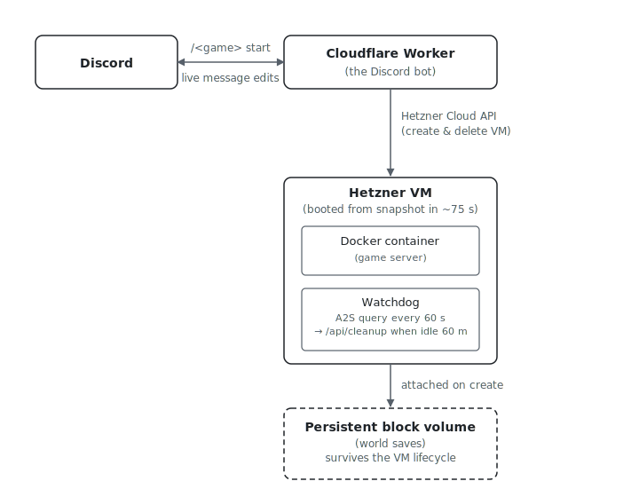

# steam-server-on-demand

[](./LICENSE)
[](https://github.com/jdmcgrath/steam-server-on-demand/commits/main)
[](https://github.com/jdmcgrath/steam-server-on-demand/stargazers)
[](./CONTRIBUTING.md)

**Pay-as-you-play dedicated hosting for any Steam game with A2S support.**

Discord-controlled. Spins up on demand in about a minute, auto-shuts down
when nobody's playing, and persists your world saves across sessions.

Built for groups who play a few hours a week and don't want a flat
£10–20 per month hosting bill for a server that sits idle 95% of the
time.

> Not a business pitch — there's no SaaS, no paid tier, no signup. It's
> open source (MIT) for anyone who wants cheap dedicated hosting for
> the games they play with their friends.

## Supported games

| Game | Docker image | Status | Game / query port |
|---|---|---|---|
| [Enshrouded](./games/enshrouded) | `sknnr/enshrouded-dedicated-server` | ✅ tested in production | UDP 15637 / 15637 |
| [Valheim](./games/valheim) | `lloesche/valheim-server` | ✅ tested end-to-end | UDP 2456 / 2457 |
| [V Rising](./games/vrising) | `trueosiris/vrising` | ✅ tested end-to-end | UDP 9876 / 9877 |
| [Palworld](./games/palworld) | `thijsvanloef/palworld-server-docker` | ✅ tested end-to-end | UDP 8211 / REST API on 8212 (internal) |

Want another A2S-compatible Steam game (Project Zomboid, 7 Days to
Die, Don't Starve Together, Core Keeper, CS2 / Source-engine games)?
A new folder under `games/` with a compose file and an `.env.example`
is usually all it takes. See `games/valheim/` for the template.

Non-A2S games (Minecraft, Factorio, Satisfactory) need a per-game
player-detection probe rather than the default A2S one. The
extension point exists (`games/<name>/probe.sh`); see
[`games/palworld/probe.sh`](./games/palworld/probe.sh) for a worked
example. PRs to add any of these welcome.

## How it works

<picture>
  <source media="(prefers-color-scheme: dark)" srcset="./docs/architecture-dark.svg">
  
</picture>

- **Cloudflare Worker** handles `start | stop | status` Discord slash
  commands. On `start`, it creates a Hetzner VM from a prepared snapshot
  and edits the Discord message live as the server provisions and boots.
- **Snapshot** contains the OS, Docker, the game install (4–10 GB
  depending on game) and any per-game patches, so the VM is fully ready
  in ~75 seconds without re-downloading via Steam each time.
- **Watchdog** queries the game's Steam A2S protocol every minute. While
  anyone's connected, the idle timer is held at zero. After 60 minutes of
  zero players, the watchdog calls back to the Worker, which deletes the
  VM.
- **Persistent block volume** is attached to each VM and holds the world
  save files. Survives the VM lifecycle so the same world loads every
  session.

## Cost

| Item | Cost |
|------|------|
| Hetzner CPX 32 VM | ~€0.022/hour (billed only while running) |
| 10 GB block volume | ~€0.40/month (always allocated) |
| Snapshot storage | ~€0.08/month per game |
| Cloudflare Worker (Free plan is enough) | £0/month |
| **Typical group (5–10 hrs/week)** | **~£1–3/month variable** |

Compared to flat-rate hosting providers at £10–20/month per game,
regardless of use.

## Repository layout

```
games/
  enshrouded/   docker-compose, .env, entrypoint patch, README
  valheim/      docker-compose, .env, README
  palworld/     docker-compose, .env, README
worker/         Cloudflare Worker source — parameterised by GAME_NAME / GAME_PORT
server/         Generic VM-side files: watchdog, systemd units
scripts/
  bake-snapshot.sh GAME=<game> ...
SETUP.md        End-to-end setup walkthrough
docs/
  blog-post.md  Architecture writeup
```

One Worker deployment per game. Run multiple games by deploying multiple
Workers (different `name` in `wrangler.jsonc`, different `GAME_NAME` env
var, different snapshot. Hetzner volumes and firewalls can be shared or
separated as you prefer).

## Quickstart

If you have a Hetzner account, a Cloudflare account, a Discord
developer application, and the [prerequisites](./SETUP.md#prerequisites)
installed, the whole flow is:

```bash
# 1. Bootstrap the Hetzner side: SSH key, firewall, saves volume
bash scripts/setup-hetzner.sh enshrouded

# 2. Configure + deploy the Worker (first pass, placeholder snapshot)
cd worker
cp wrangler.jsonc.example wrangler.jsonc
$EDITOR wrangler.jsonc                # fill in the IDs from step 1
wrangler secret put HETZNER_TOKEN
wrangler secret put WATCHDOG_SECRET   # save a copy — needed in step 4
npm install && wrangler deploy

# 3. Register the /enshrouded slash command (see SETUP.md §3 for the
#    Discord application setup itself)

# 4. Bake the snapshot. Create a temp Hetzner VM with the saves volume
#    attached, SSH in, then one command:
export WORKER_URL=https://<your-worker>.workers.dev/api/cleanup \
       WATCHDOG_SECRET=<from step 2> \
       SERVER_NAME="My Shroud" \
       SERVER_PASSWORD=<your-password>
curl -fsSL https://raw.githubusercontent.com/jdmcgrath/steam-server-on-demand/main/scripts/bake-bootstrap.sh \
  | bash -s -- enshrouded

# 5. Wait for the steam download, stop the container, take the snapshot,
#    delete the bake VM. Update HETZNER_SNAPSHOT_ID in wrangler.jsonc.
cd worker && wrangler deploy

# 6. Sanity-check everything wired up correctly
bash scripts/verify.sh

# 7. /enshrouded start in your Discord
```

Substitute `valheim`, `palworld`, or `vrising` for `enshrouded` to set
up other games.

## Setup

See [**SETUP.md**](./SETUP.md) for the full walkthrough with
explanations: Hetzner project bootstrap, Discord application, baking
the snapshot, deploying the Worker. Plan ~45 minutes per game, most
of which is the one-off Steam download during the bake step.

You'll need:

- A Hetzner Cloud account (per-hour VM billing)
- A Cloudflare account (the Free tier is enough; the 75 s background
  poll fits inside Free's CPU/request limits since the work is mostly
  network I/O and `setTimeout`)
- A Discord application with a bot user per game

## Contributing

PRs welcome. The single highest-leverage contribution is adding
support for another game — usually one new folder under `games/` with
two files. See [**CONTRIBUTING.md**](./CONTRIBUTING.md) for the
walkthrough.

Other open issues live on the [issues
page](https://github.com/jdmcgrath/steam-server-on-demand/issues).

## Credits

- Enshrouded image: [`sknnr/enshrouded-dedicated-server`](https://github.com/sknnr/enshrouded-dedicated-server)
- Valheim image: [`lloesche/valheim-server`](https://github.com/lloesche/valheim-server-docker)
- V Rising image: [`trueosiris/vrising`](https://github.com/TrueOsiris/docker-vrising)
- Palworld image: [`thijsvanloef/palworld-server-docker`](https://github.com/thijsvanloef/palworld-server-docker)

## License

MIT. See [LICENSE](./LICENSE).
